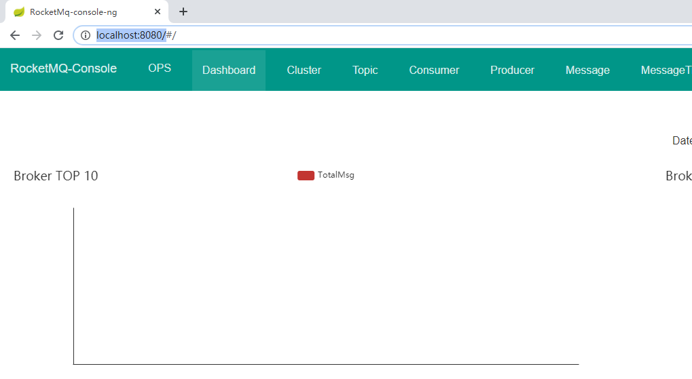
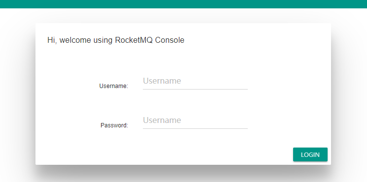

# fu-rocketmq-console
rocketmq-console with acl 

#### 在rocketmq-console基础上加ACL验证,用于管理配置了安全验证的rocketmq

官方迟迟不更新,自已折腾. 官方更新后本项目终止 .

#### 修改源自
https://github.com/apache/rocketmq-externals/tree/master/rocketmq-console
https://gitee.com/withcatandyou/rocketmq-console

#### 2020.7
1. 更新rocketmq到4.7.1
2. 支持 acl
2. 支持 登录

### quick start
clone 项目 maven 打包 得到 fu-rocketmq-console.jar 文件
或直接下载  fu-rocketmq-console.jar
#### 启动
必选参数 --rocketmq.config.namesrvAddr
```
java -jar fu-rocketmq-console.jar --rocketmq.config.namesrvAddr=<your-rocketmq-namesrv-addr>
```
把 <your-rocketmq-namesrv-addr> 换成你的namesrv, 比如 localhost:9876

访问 localhost:8080 即可


#### 更换端口
加参数 --server.port=9090
```
java -jar fu-rocketmq-console.jar --server.port=9090 --rocketmq.config.namesrvAddr=<your-rocketmq-namesrv-addr>
```

## ACL
### 方法
修改 application.properties

默认不支持
```yml
#acl switch
rocketmq.config.aclEnabled=false
rocketmq.config.accessKey=
rocketmq.config.secretKey=
```
修改类似为:
```yml
#acl switch
rocketmq.config.aclEnabled=true
rocketmq.config.accessKey=rocketmq2
rocketmq.config.secretKey=12345678
```

## 登录

### 方法
修改 application.properties
```yml
rocketmq.config.loginRequired=false
```
修改为:
```yml
rocketmq.config.loginRequired=true
```

默认帐号:admin,密码:123456

修改 users.properties
```yml
# Define Admin
admin=123456,1
```
123456改成自己的密码
